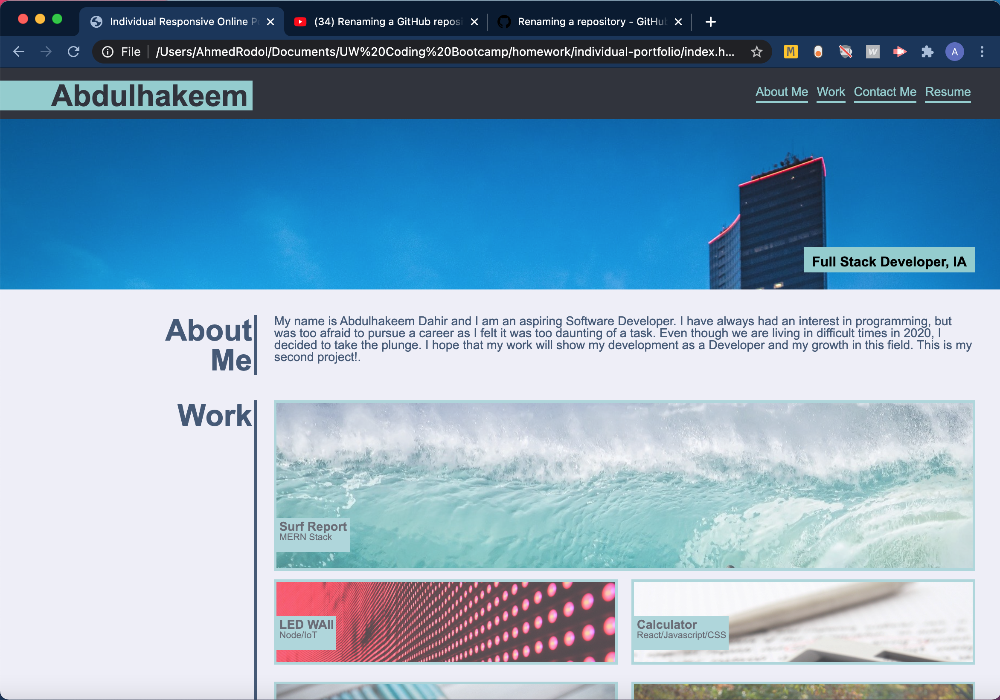

# Individual Responsive Online Portfolio

UW Bootcamp Week 2 Homework Assignment

## Table of Contents

- [Developer Comment](#developer-comment)
- [Employer Request](#employer-request)
- [User Story](#user-story)
- [Acceptance Criteria](#acceptance-criteria)
- [Mockup](#mockup)
- [Website Features and Highlights](#website-features-and-highlights)
- [Live Project Site](#live-project-site)
- [Installation and Git Repository](#installation-and-git-repository)
- [Credits](#credits)

## Developer Comment

Hello everyone, and welcome back to my Repo! My name is Abdulhakeem Dahir and I am an aspiring Software Developer. This week I have been tasked to make a responsive online website. I am super excited to use my Week 2 skills to create this project. Any feedback is welcome! Thank you!

## Employer Request

An Employer is looking to hire a Web Developer for a Full Time or Part Time role. They are seeking someone who can showcase their talent and skillset by having a Live and Deployed Portfolio. The Portfolio itself must be responsive, and it must showcase all of the work that the applicant has done.

### User Story

```
AS AN employer
I WANT to view a potential employee's deployed portfolio of work samples
SO THAT I can review samples of their work and assess whether they're a good candidate for an open position
```

### Acceptance Criteria

```
GIVEN I need to sample a potential employee's previous work
WHEN I load their portfolio
THEN I am presented with the developer's name, a recent photo, and links to sections about them, their work, and how to contact them
WHEN I click one of the links in the navigation
THEN the UI scrolls to the corresponding section
WHEN I click on the link to the section about their work
THEN the UI scrolls to a section with titled images of the developer's applications
WHEN I am presented with the developer's first application
THEN that application's image should be larger in size than the others
WHEN I click on the images of the applications
THEN I am taken to that deployed application
WHEN I resize the page or view the site on various screens and devices
THEN I am presented with a responsive layout that adapts to my viewport
```

## Mockup


## Website Features and Highlights

The follwing are all of the feautres and highlights of my portfolio:

### HTML

```
- Used semantic Html for my website structure
- Sectioned areas so as to layout more easily
- Created both an Aside and Container class for easier flex layout.
- Validated my code with w3 validator.
```

### CSS

```
- Used CSS variables for more robust styling
- Used Flexbox for a responsive layout
- Consolidated CSS for better codebase
- Used Media queries for Mobile based viewing
```

### Images

```
- Used free images from Pixelbay
- Optimized all images for load-times.
```

## Live Project Site

https://abdulhakeemdahir.github.io/Individual-Responsive-Online-Portfolio/



## Installation and Git Repository

Respository: https://github.com/abdulhakeemdahir/Individual-Responsive-Online-Portfolio

Please follow the installation process below:

```
1. Fork the repository from the link above
2. Clone the repo to your computer via git
3. Open the project files with the text editor of your choice.
```

## Credits

Pixelbay for all of the Free Images that I used!
